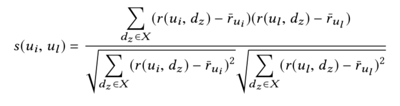
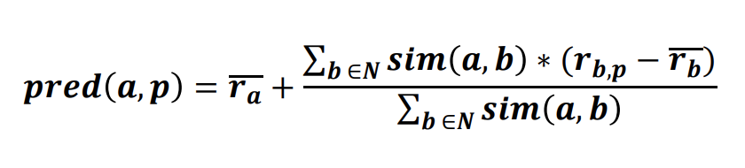

# Implementation for thesis on the subject: Fair Sequential Group Recommendations

Calculates a sequence of group recommendation usings collaborative filtering. The main idea is to use two or more group recommendation methods to be able to compare how the methods perform regarding both **group satisfaction** and **fairness**.

First, calculate individual recommendation lists for the users in a group. Pearson Correlation is used to calculate similarities between users when searching for similar users in the ratings data.

Then, at each round calculate the group recommendation list. After each round calculate the satisfaction score for each user in the group regarding the group recommendation list. And save group satisfaction (average of individual users' satisfaction scores) and group disagreement (defined as max(individual_satisfaction_scores) - min(individual_satisfaction_scores)).

Can be used to calculate N rounds of recommendations for M groups using two or more group recommendation methods.

Pearson Correlation:

Prediction function:

## `calculations.py`
Contains main recommendation and calculation methods. Uses `similarities.py` for calculating similarity values between users.

## `groupformation.py`
Contains group formation scripts that can be used to extract certain types of groups from the given data. Uses `similarities.py` for calculating similarity values between users.

## `groups.py`
Extract and create certain types of groups by using `groupformation.py` and save as .csv file to `groupformation` folder.

## `recommendations.py`
Main file for calculating recommendations for groups (one group at a time).

For each recommendation round, calculates the group recommendation list as well as group satisfaction and group disagreement. 

For multiple recommendation rounds, calculates the average group satisfaction and average group disagreement. 

Can be used to directly compare two or more recommendation methods.

## `similarities.py`
Contains main methods for calculating similarities between users.

## `visualization.py`
Contains simple visualization methods for plotting results.

## `grouptypes`

grouptypes folder contains groups of users divided to certain group types. Different types of groups are saved in separate .csv files in the folder.

## `movielens-small`

movielens-small folder contains a small MovieLens data set (100 000 ratings). The small data set was used for initial testing.

*NOTE the [MovieLens 25M Dataset](https://grouplens.org/datasets/movielens/) (25 million ratings) is used for the actual implementation*